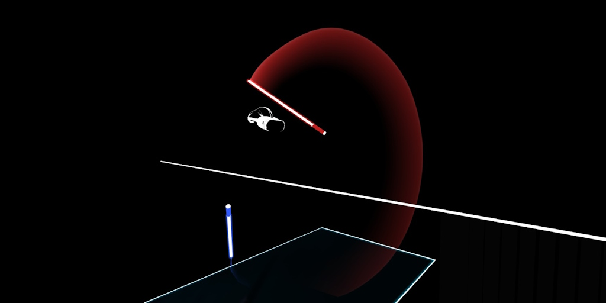

**Deep Motion Masking for Secure, Usable, and Scalable Real-Time Anonymization of Virtual Reality Motion Data**

This is an anonymized version of the deep motion masking codebase for use in double-blind peer review only. For those interested in implementing our system in the future, please search for our main repository on GitHub.

Research has shown that the head and hand motion data measured by virtual reality (VR) devices can uniquely identify over 50,000 users with nearly 95% accuracy [[1]](https://www.usenix.org/conference/usenixsecurity23/presentation/nair-identification). Previous attempts to anonymize VR motion data have used differential privacy [[2]](https://arxiv.org/abs/2208.05604), but these techniques fail in light of more sophisticated recent attacks. "Deep motion masking" is a new technique for anonymizing VR motion data in a way that is both more secure and usable than previous attempts.
The resulting system respects causality and can be deployed on a stream of motion data in real-time. Due to use of deep learning, deep motion masking has the potential to anonymize more complicated data streams, such as full-body motion data, in the near future.

#### Dependencies
We used Python v3.10.2 on Windows 10 for training and testing all components of our system. The names and recommended versions of all Python dependencies are listed below. No other platforms or versions are officially supported.
- numpy v1.25.1
- pandas v1.4.3
- tqdm v4.64.0
- py_bsor v0.9.14
- tensorflow v2.10.1
- matplotlib v3.5.2
- lightgbm v3.3.3
- scikit-learn v1.2.0
- matplotlib v3.5.2

#### Dataset
Training and testing this system requires use of the [BOXRR-23 dataset](https://arxiv.org/abs/2310.00430).

#### Usage

##### 0. Motivation: `motivation/`

This group of scripts exists to motivate the need for our system. They are not essential for training a deep motion masking model, and can safely be skipped.

- To run the identification evaluation using our new LSTM Funnel method, run `m01-dataset.py` and then run `m02-model.py`.
- To run the identification evaluation using the method of Miller et al. (2020) [[3]](https://www.nature.com/articles/s41598-020-74486-y), run `m03-miller-features.py` and then run `m04-miller-test.py`.
- To run the identification evaluation using the method of Nair et al. (2023) [[1]](https://www.usenix.org/conference/usenixsecurity23/presentation/nair-identification), run `m05-nair-features.py` and then run `m06-nair-test.py`.

##### 1. Data Sampling: `data/`

This group of scripts handles the data preprocessing necessary to train and evaluate a deep motion masking model.

- To sample replays for training the action similarity model, run `d01-action-similarity.py`.
- To sample replays for training the user similarity model, run `d02-user-similarity.py`.
- To sample replays for evaluating the user identification accuracy, run `d03-user-identification.py`.

##### 2. Components: `parts/`

This group of scripts trains all of the individual components of a deep motion masking model.

- To train the action similarity model, run `p01-action-similarity.py`.
  - The action similarity model can be fine-tuned by running `p01x-tune-action-similarity.py`.
- To train the user similarity model, run `p02-user-similarity.py`.
  - The user similarity model can be fine-tuned by running `p02x-tune-user-similarity.py`.
- To train the anonymization model, run `p03-anonymizer.py`.
- To train the normalization (noise reduction) model, run `p04-normalizer.py`.

##### 3. Preview: `preview/`

This script exists to help preview the results of a trained model anonymization. It is not essential for the evaluation, and can safely be skipped.

- To preview the anonymized motion data with and without normalization, place one or more Beat Saber replays in the `0-replays` folder and run `preview.py`. The control, anonymized, and normalized versions of the replays will be placed in the `1-control`, `2-anonymized`, and `3-normalized` folders, respectively. You can then use a [web replay viewer](https://replay.beatleader.xyz) to visualize the replays.

##### 4. Evaluation: `evaluation/`

This group of scripts exists to facilitate the evaluation of a deep motion masking model.

- Run `e01-build-usability.py` to set up the randomized human study portion of the evaluation. Place responses in `usability/results.txt` in CSV format, then run `e02-analyze-usability.py` to evaluate the usability results.
- To run the anonymity evaluation using the method of Miller et al. (2020) [[3]](https://www.nature.com/articles/s41598-020-74486-y), run `e03-miller-features.py` and then run `e04-miller-test.py`.
- To run the anonymity evaluation using the method of Nair et al. (2023) [[1]](https://www.usenix.org/conference/usenixsecurity23/presentation/nair-identification), run `e05-nair-features.py` and then run `e06-nair-test.py`.
- To run the anonymity evaluation using our new LSTM-based method, run `e07-funnel-features.py` and then run `e08-funnel-test.py`.
- To run the interactivity evaluation, run `e09-interactivity-data.py` and then run `e10-interactivity-test.py`.

#### Sample Results

All of the below results were obtained using a workstation PC running Windows 10 v10.0.19045 r19045 with an AMD Ryzen 9 5950X 16-Core 3.40 GHz CPU, NVIDIA GeForce RTX 3090 GPU, and 128 GB of DDR4 RAM.

##### Observed Runtime

The observed runtime of each script was as follows:

| **Script**                  | **Runtime** |
|-----------------------------|-------------|
| m01-dataset                 | 37h 14m 18s |
| m02-model                   | 3h 49m 34s  |
| m03-miller-features         | 2h 54m 25s  |
| m04-miller-model            | 0h 4m 8s    |
| m05-nair-features           | 16h 31m 50s |
| m06-nair-model              | 0h 13m 47s  |
|                             |             |
| d01-action-similarity       | 55h 40m 5s  |
| d02-user-similarity         | 57h 12m 9s  |
| d03-user-identification     | 3h 24m 27s  |
|                             |             |
| p01-action-similarity       | 3h 3m 52s   |
| p01x-tune-action-similarity | 0h 23m 22s  |
| p02-user-similarity         | 0h 57m 1s   |
| p02x-tune-user-similarity   | 0h 21m 8s   |
| p03-anonymizer              | 3h 15m 15s  |
| p04-normalizer              | 0h 56m 51s  |
|                             |             |
| e03-miller-features         | 0h 40m 51s  |
| e04-miller-test             | 0h 5m 9s    |
| e05-nair-features           | 3h 41m 58s  |
| e06-nair-test               | 1h 12m 17s  |
| e07-funnel-features         | 0h 0m 34s   |
| e08-funnel-test             | 0h 8m 18s   |
| e09-interactivity-data      | 0h 37m 10s  |
| e10-interactivity-test      | 0h 4m 32s   |
|                             |             |
| _Total_                     | _192h 52m_  |

##### Observed Training Metrics

In our evaluation, the observed training metrics of each component were as follows:

- The action similarity model achieved 100.00% training accuracy, 99.53% validation accuracy, and 99.40% testing accuracy (best epoch: 156).
- The user similarity model achieved 97.94% training accuracy, 92.60% validation accuracy, and 92.81% testing accuracy (best epoch: 27).
- The anonymization model achieved anonymization accuracy of 95.54% in training and 94.71% in testing, with 100.00% action similarity accuracy.
- The normalization model achieved a mean squared error of 0.0015 and a mean absolute error of 0.0249.
